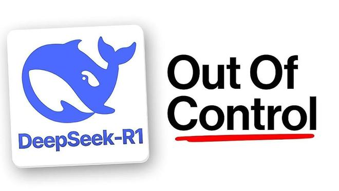

# 大前端学习
## 配置环境
### 第一章
#### 1. 安装基础软件
Web浏览器及版本控制器git等

#### 2.浏览互联网
网页、网站、web服务器及搜索引擎区别
网页: 能够显示在web浏览器上的文档，也称为”页面“；
网站: 网页组成，以各种方式连接，也称为”站点“；
web服务器: 互联网上托管一个或多个网站的计算机；
搜索引擎：是一个帮助用户搜索到其他网站的网站

什么是URL？
网络上所有可用网页独一无二的地址，通过URL访问到；

#### 3. 代码编辑器

#### 4. 处理文件
##### 网站应该使用什么结构？
测试网站的常用结构：
index.html：主页内容，用户第一次访问网站看到文字及图片
images文件夹：网站上使用所有图片
styles文件夹：提供CSS样式，文本及背景色
scripts文件夹：给网站提供交互功能的javaScript代码

#### 5. 命令行速成
Glitch.com   test网址 支持访问本机 练习终端命令
Prettier 是一款专门为前端开发人员设计的代码格式化工具，专注于基于 javascript 的语言，
npm 是 JavaScript 世界里最为流行的包管理工具，同时也是 Node.js 的默认包管理器
##### 兴趣使然，更多工具，进程查看器：当某些东西使cpu风扇行为像一个喷气发动机，可以学习使用它；并且可以看出错程序有用 TODO

### 第二章 HTML基础
#### 1. 网站是怎样的
#### 2. HTML基础
**什么是HTML**
HTML是一种用于定义内容结构的标记语言。可以由一段文字、图片及超链接组成。能够设置文字字体等；
My cat is very grumpy

My cat is very grumpy

记忆方式： p -> paragraph  段落
以上组成方式： 1. 开始标签； 2. 结束标签  3. 内容  4. 元素

**有值属性包括**
1. 属性与元素名称之间的一个空格
2. 属性名，后接一个等号
3. 属性值，''一对引号包围

<strong>嵌套元素</strong>
将一个元素嵌套在另一个元素中,

My cat is <strong>very</strong> grumpy(脾气坏的).

<strong>空元素</strong>
不包含任何内容的叫做空元素； 更好理解应该是<strong>空标签</strong>/<strong>单标签</strong>。
比如：

&lt;img&gt;&lt;br&gt;以及&lt;input&gt;

